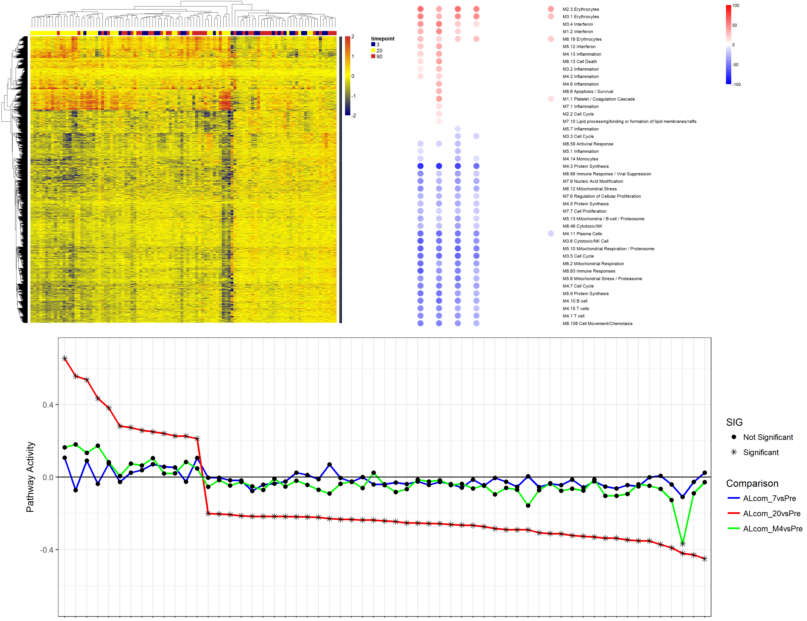

**B**io-statistical **A**nalysis **R**eporting **T**ool
===================================================================================================================================================================================

------------------------------------------------------------------------

  

### **Introduction**

BART is an application developed for researchers to interactively
visualize statistically analyzed results of high-throughput 'omics'
experiments.

### **Installation**
First, install `BART` dependencies from CRAN:
```r
install.packages(c("shiny", "shinydashboard", "shinyjs", "ggplot2", "RColorBrewer", "fastcluster", "NMF", "grid", "clValid","VennDiagram","gtools","scales","reshape2","data.table","tidyverse","janitor","DT"))
```

Then, `BART` can be run with the following command:
```r
shiny::runGitHub("jcardenas14/BART", ref = "beta")
```